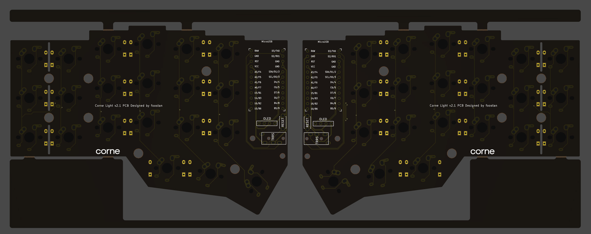
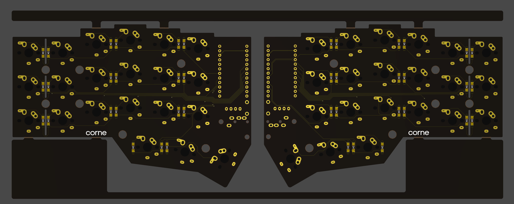
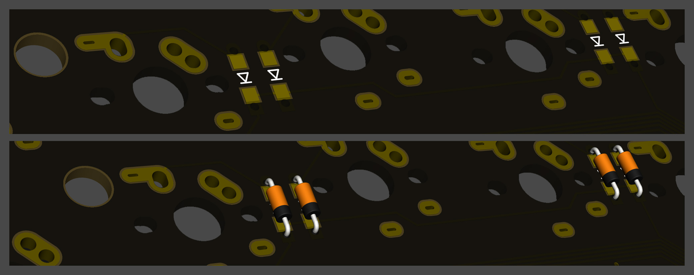
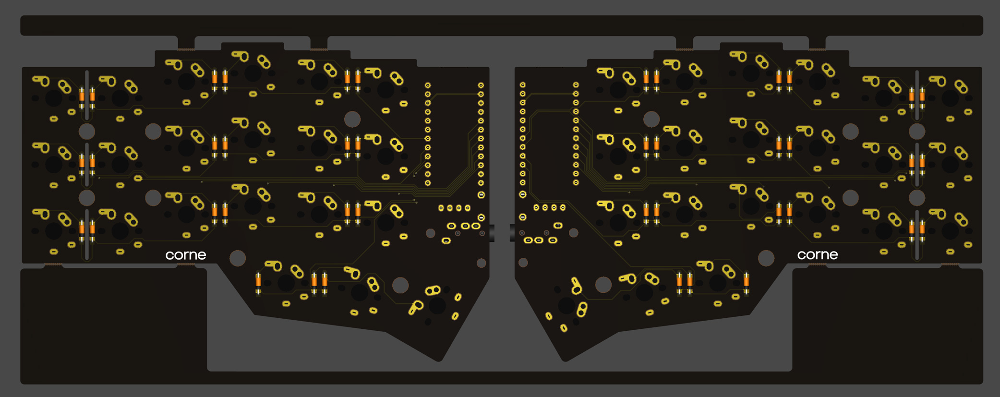
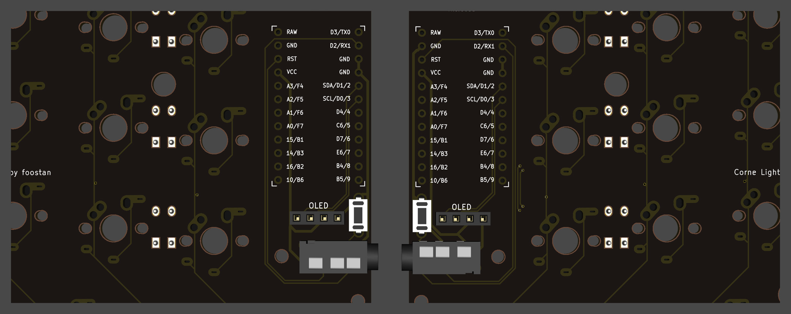
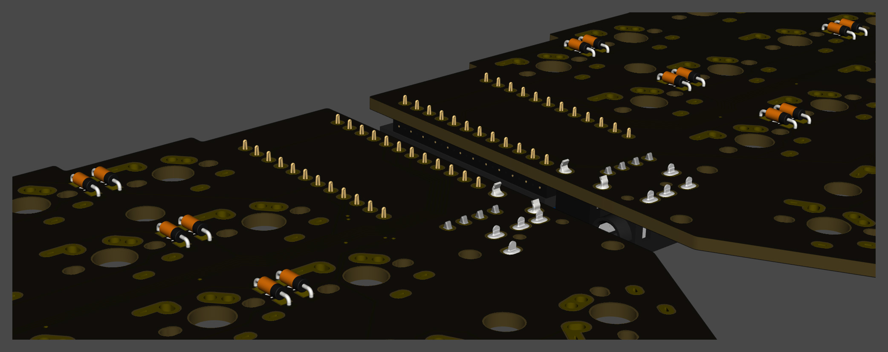
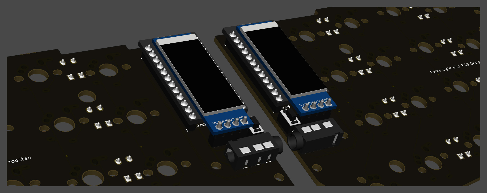
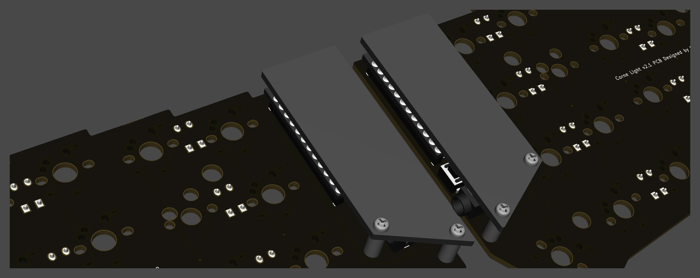
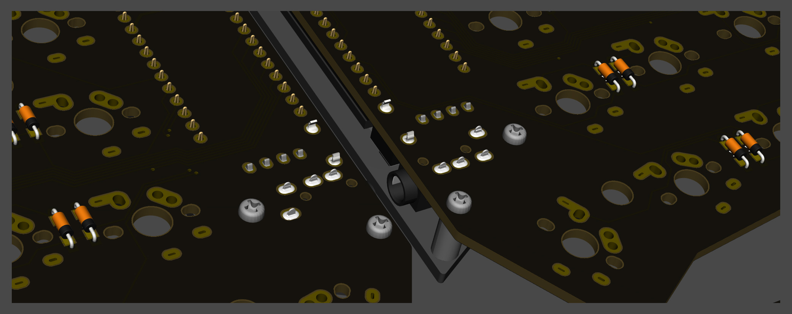
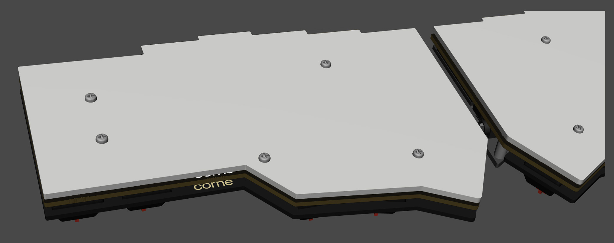

# Build Guide

こちらは Corne Light v2 にて CherryMX互換 スイッチを使用する場合のビルドガイドになります。

## 部品
### 必須
| 名前 | 数 | 備考 | 
|:-|:-|:-|
| PCB | 1セット | |
| トッププレート | 2枚 | |
| ボトムプレート | 2枚 | |
| OLED保護プレート | 2枚 | |
| ProMicro | 2枚 | |
| TRRSジャック | 2個 | |
| タクトスイッチ | 2個 | |
| ダイオード | 42本 | リード部品またはSMD部品 |
| キースイッチ | 42個 | CherryMX互換 |
| キーキャップ | 42個 | 1u 40個、1.5u 2個 |
| スペーサー M2 7.5mm | 10本 | |
| スペーサー M2 9mm | 4本 | |
| ネジ M2 4mm | 8本 | |
| TRRS(4極)ケーブル | 1本 | TRS(3極)ケーブルでも可 |
| Micro USBケーブル | 1本 | |

### オプション
| 名前 | 数 | 備考 |
|:-|:-|:-|
| OLEDモジュール | 2枚 | |
| OLEDモジュール用ピンヘッダ 4連 1.5mm | 2つ | |
| OLEDモジュール用ピンソケット 4連 2.5mm | 2つ | |

## 事前準備
ファームウェアを自分でビルドする場合は環境を整備するのに時間がかかるのではじめに取り掛かっておくことをおすすめします。\
詳しくは https://github.com/foostan/crkbd/blob/master/doc/firmware_jp.md を参照してください。

## 確認

Corne Light v2 のPCBは以下のものになります。お手持ちのPCBと同一のものかご確認ください。

PCBは製造の都合上フレームが付いた状態となっています。
手で折って外すことができますが、難しい場合は接合部分※にカッター等で切り込みを入れると外しやすくなります。
また、接合部分はヤスリ等できれいにすることができます。

※ 接合部分: 下記画像の赤で記した部分のこと、計8箇所あります

## 組み立て
### ダイオード

リード部品のダイオードのはんだづけを行います。

**ダイオードは取り付ける向きが決まっていて**、部品の黒い印が、ダイオードマーク「|◁」の「|」の方に向けるようにはんだづけを行います。
表に見えているパッドはSMD部品のものなので、リード部品を利用する場合は裏からはんだ付けをしてください。
またリード部品は、マスキングテープ等でパーツを固定してから余分なリード部分を切っておくと簡単にできます。

なお、Corne の PCB はダイオードの取り付け向きがすべて統一されています。

左右合わせて42個をはんだづけしてダイオードは完了です。

### TRRSジャック、リセットスイッチ、OLED用ピンソケット

下記の写真通りにTRRSジャック、リセットスイッチ(タクトスイッチ)、OLED用ピンソケットをはんだづけします。

ずれやすい部品なので、手で部品を抑えながらはんだづけするか、マスキングテープ等で固定してからはんだづけするときれいに付きます。

### ProMicro
ProMicroを下記のような向きではんだ付けします

なお、コンスルーを利用する場合は裏側のはんだ付けをする必要はありません。
コンスルーの詳しい利用方法は [Helix のビルドガイド](https://github.com/MakotoKurauchi/helix/blob/master/Doc/buildguide_jp.md#pro-micro)をご参照ください。

### OLEDモジュール
OLED用のピンソケットにピンヘッダを先に差し込み、その後からピンヘッダとOLEDモジュールをはんだづけします。
このときOLEDモジュールが浮きやすいので指で押さえつけながら浮かないように気をつけます。

### ファームウェア
下記を参照しファームウェアをProMicroに書き込みます。\
https://github.com/foostan/crkbd/blob/master/doc/firmware_jp.md

### 動作確認
ProMicroとOLEDモジュールを付けた段階で動作確認をすることをおすすめします。
一番最後にやると問題の切り分けが難しくなります。

動作確認は左手側はMicroUSBでPCとつなぎ、左手側と右手側をTRRSケーブルで接続させて行います。
ジャック等の不良等もありえるので、片方ずつではなく必ず左右を接続させてから動作確認をしてください。
ここまで正しくできていれば、スイッチを取り付ける箇所をピンセット等でショートさせるとOLEDモジュールに押されたキーが表示されます。

### スイッチ

### OLED保護プレート

M2 9mm のスペーサーと M2 ネジで OLED 保護プレートを取り付けます。

### プレート、スイッチ

トッププレートにキースイッチに取り付けた後、キースイッチをソケットにはめ込みます。
先にすべてのキースイッチをトッププレートに取り付けてしまうと、ソケットにはめ込む難易度が上がってしまうため、先に端のキースイッチのみを取り付ける方が簡単です。

M2 7.5mm のスペーサーと M2 ネジ をトッププレートに取り付けます。

裏側からスペーサーを穴に入れた後、ネジ止めをすると簡単です。

ボトムプレートを M2 ネジで取り付けます。

クッションゴムを以下の位置に取り付けます。

以上で完成です。

